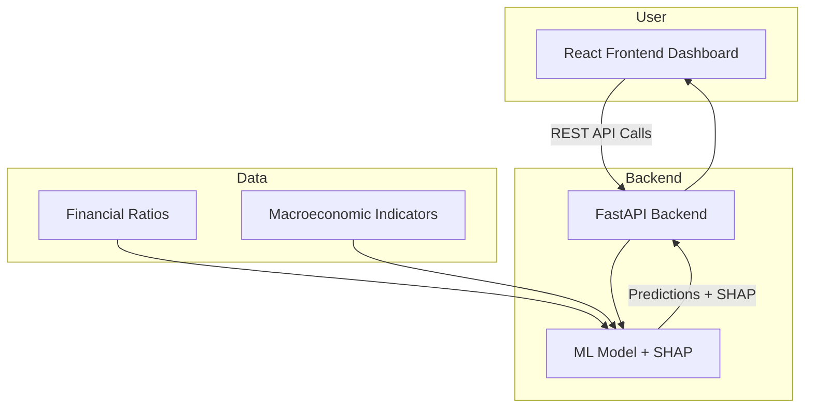

# Real-Time Explainable Credit Intelligence Platform  

This project is a **full-stack platform** for assessing and explaining creditworthiness of companies.  
It combines **machine learning**, **financial ratios** and **macroeconomic indicators** served through an interactive **FastAPI backend** and a **Next JS frontend**.  

Here is the link to the fully deployed app : https://credtech-frontend-d2jc.vercel.app
---

## Code Architecture  

project-root/
│
├── backend/                
│   ├── main.py             
│   ├── models/             
│   ├── requirements.txt  
│   └── Dockerfile 
│            
│
├── frontend/               
│   ├── app/
│   │   ├── components/    
│   │   ├── pages/         
│   │   └──  
│   └── package.json       


---

##  Core Features  

###  Machine Learning Backend  
- **Model Inputs (11 features):**  
  - Financial ratios: `currentRatio`, `quickRatio`, `cashRatio`, `debtRatio`, `debtEquityRatio`   from ``` yfinance ```
  - Macroeconomic indicators: `GDP`, `INTEREST_RATE`, `INFLATION`   from FRED
  - Displaying the  features of the latest date in the section of FINANCIAL SNAPSHOT  

- **Explainability with SHAP**  
  - Feature-level attributions for each prediction  
  - Transparent scoring with clear explanations  

- **API Endpoints**  
  
  - `/company?symbol="XYZ_Company_ticker"` → Returns 30-day history of predictions + feature evolution   and the latest values of financial scores like GDP,NTEREST_RATE, INFLATION etc.
  
  
- **Fully Deployable via Docker**
  - Backend is containerized via docker.
  - Frontend is deployed on Vercel.
  - **Backend Dockerfile** builds a Python image with FastAPI + Uvicorn.
  - Pushed images to Google Artifact Registry and then deployed backend using GCP
 

---

###  Frontend Dashboard  
- Built with  Next JS and Tailwind  
- Key components:  
  -  **Score Dashboard** → Issuer-level credit score  
  - **Trend Charts** → Credit score changes over time  
  -  **Explainability Panel** → SHAP values for feature attribution  
  - **Company Lookup** → Fetch latest company-specific predictions  

---

##  System Architecture  


### Running Locally  
**Run Backend(without docker)**
   ```bash
   cd my-backend
   python -m venv venv
   source venv/bin/activate   # On Windows: venv\Scripts\activate
   pip install -r requirements.txt
   uvicorn main:app --reload
```

**Run Backend(with docker)**
   ```bash
   cd my-backend
   docker build -t my-backend ./backend 
   docker run -p 8080:8080 my-backend
```


**Run Frontend**
   ```bash
cd my-frontend
npm install
npm run dev
```

   


